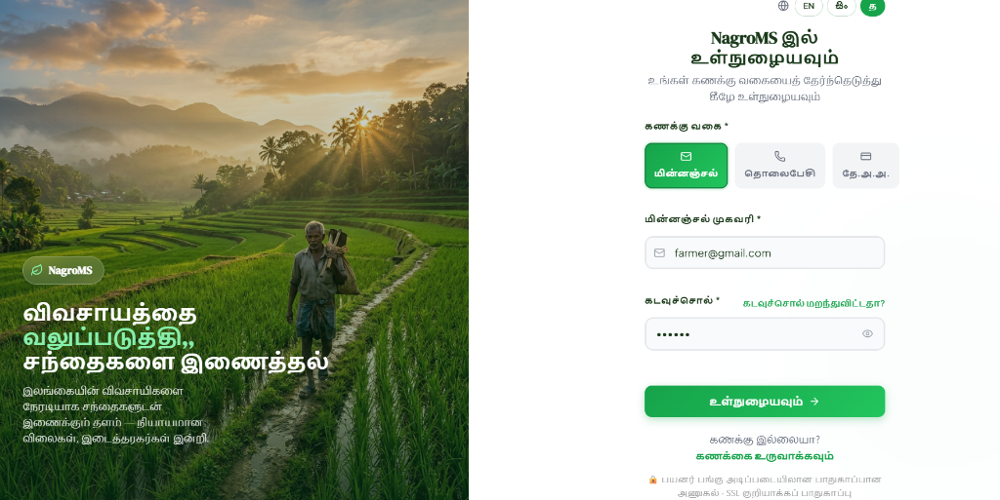
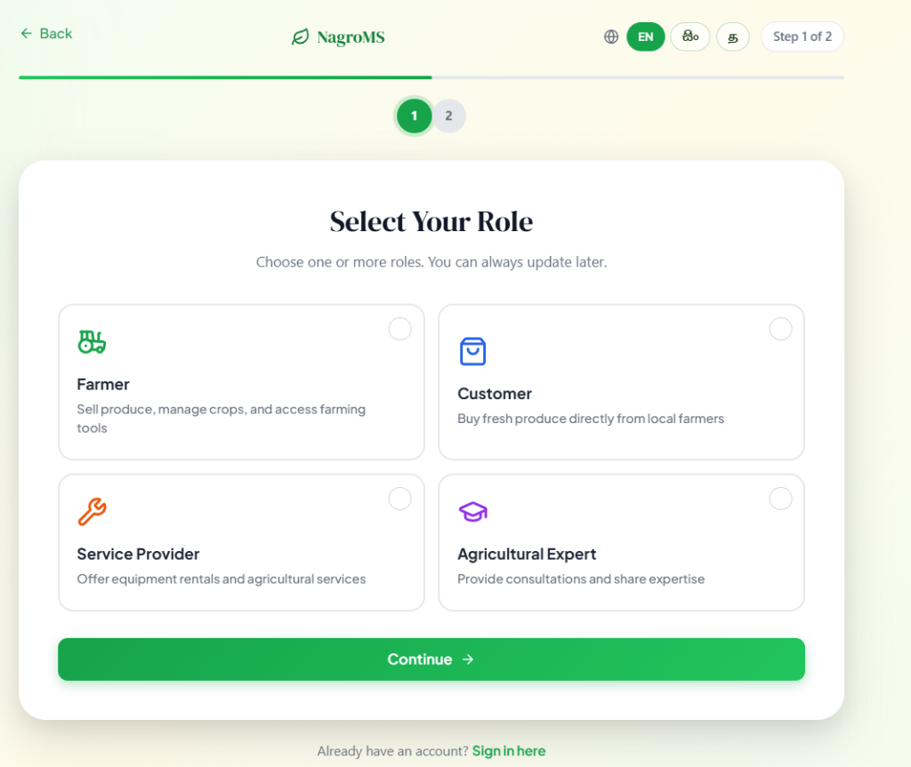
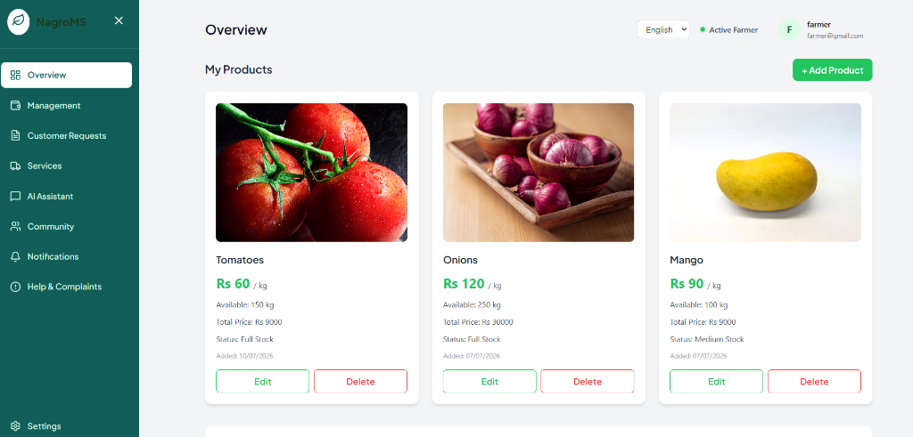
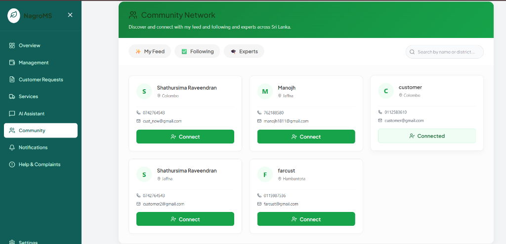
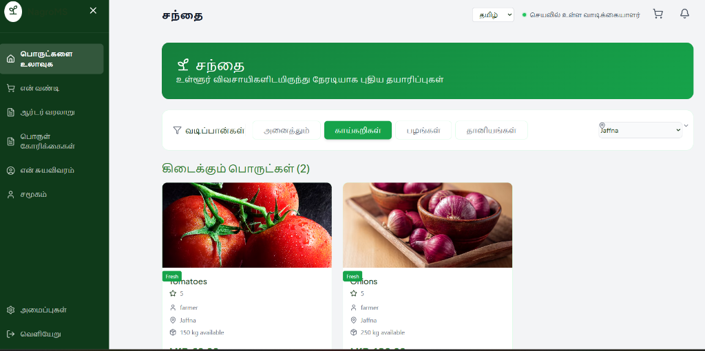

# Networked Agro Management System (NagroMS)

[](https://github.com/cepdnaclk/e22-co2060-nagroms)
[](https://github.com/cepdnaclk/e22-co2060-nagroms)
[](http://www.ce.pdn.ac.lk/)
[](https://eng.pdn.ac.lk/)

> **NagroMS** is a digital agricultural ecosystem and direct trading marketplace engineered to empower Sri Lankan farmers. By eliminating exploitative middle vendors, connecting farmers with bulk buyers and consumers, and integrating agricultural services, NagroMS fosters transparent pricing, enhanced farmer profits, and nationwide agricultural collaboration.

---

## 👥 Team & Supervisors

### 👨‍💻 Project Team
| Reg No. | Name | Email | Responsibilities |
| :--- | :--- | :--- | :--- |
| **E/22/330** | R. Shathursima | [e22330@eng.pdn.ac.lk](mailto:e22330@eng.pdn.ac.lk) | Expert Dashboard, Consultations & Community Features |
| **E/22/381** | S. Monisha | [e22381@eng.pdn.ac.lk](mailto:e22381@eng.pdn.ac.lk) | Farmer Dashboard, Produce Inventory & Backend Models |
| **E/22/261** | N. Sathurjika | [e22261@eng.pdn.ac.lk](mailto:e22261@eng.pdn.ac.lk) | Multilingual Authentication, OTP System & Landing Experience |
| **E/22/260** | K. Nithilaa | [e22260@eng.pdn.ac.lk](mailto:e22260@eng.pdn.ac.lk) | Customer Marketplace, Order Management & Service Providers |

### 👨‍🏫 Project Supervisor
- **K. Jarshigan** ([e21188@eng.pdn.ac.lk](mailto:e21188@eng.pdn.ac.lk)) — Department of Computer Engineering, University of Peradeniya

---

## 📑 Table of Contents
1. [Introduction & Problem Statement](#-introduction--problem-statement)
2. [Key Objectives](#-key-objectives)
3. [User Roles & Ecosystem](#-user-roles--ecosystem)
4. [User Interface Showcase](#-user-interface-showcase)
   - [Multilingual & Multi-Identifier Authentication](#1-multilingual--multi-identifier-authentication)
   - [Dynamic Role Onboarding](#2-dynamic-role-onboarding)
   - [Farmer Produce & Inventory Management](#3-farmer-produce--inventory-management)
   - [Direct Agricultural Marketplace](#4-direct-agricultural-marketplace)
   - [Community Network & Expert Hub](#5-community-network--expert-hub)
5. [System Architecture](#-system-architecture)
6. [Security & Quality Assurance](#-security--quality-assurance)
7. [Testing Strategy](#-testing-strategy)
8. [Conclusion & Future Roadmap](#-conclusion--future-roadmap)
9. [Links & References](#-links--references)

---

## 🌾 Introduction & Problem Statement

In the conventional Sri Lankan agricultural supply chain, farmers encounter severe bottlenecks:
- **Disproportionate Middle Vendor Dependency:** Intermediaries extract significant profit margins, leaving grassroots farmers with minimal earnings.
- **Restricted Market Reach:** Smallholder farmers struggle to reach bulk buyers (supermarkets, food cities, and commercial retailers) directly.
- **Fragmented Support Services:** Farming equipment rental, logistics, and expert consultation services operate in isolation.
- **Language & Technology Barriers:** Lack of accessible, local-language digital tools tailored to diverse agricultural demographics.

**NagroMS** solves these systemic challenges by delivering an accessible, multilingual, and integrated digital hub for direct trading, farm logistics, and expert advisory.

```
+------------------+         +-------------------------------+         +---------------------+
|   Local Farmers  | <-----> |   NagroMS Central Marketplace | <-----> |  Buyers & Retailers |
+------------------+         +-------------------------------+         +---------------------+
                                            |
                             +-------------------------------+
                             |  Experts & Service Providers  |
                             +-------------------------------+
```

---

## 🎯 Key Objectives

- **Fair & Transparent Pricing:** Direct farmer-to-buyer transactions ensure fair value for produce without price inflation by brokers.
- **Multilingual Accessibility:** Full native support for **English**, **Sinhala (සිංහල)**, and **Tamil (தமிழ்)** to maximize user adoption across all provinces.
- **Holistic Farm Management:** Enable farmers to manage harvest listings, live stock status, sales, and equipment rentals in one platform.
- **Knowledge Sharing & Advisory:** Integrated community networking and consultation channels with verified agricultural experts.

---

## 👥 User Roles & Ecosystem

NagroMS supports distinct, persona-driven workflows:

| Role | Core Capabilities |
| :--- | :--- |
| 🧑‍🌾 **Farmer** | List produce with real-time stock levels, manage orders, track farm income/expenses, request equipment, and consult experts. |
| 🛒 **Customer & Retailer** | Browse verified local crops, filter by province/district and category, order fresh produce directly, and request custom produce batches. |
| 🔧 **Service Provider** | List tractors, harvesters, irrigation equipment, and transport services for rent to local farming communities. |
| 🎓 **Agricultural Expert** | Provide advisory services, diagnose crop ailments, respond to inquiries, and share farming best practices. |
| 🛡️ **Administrator** | Monitor platform security, manage verifications, audit transactions, and resolve disputes. |

---

## 📸 User Interface Showcase

NagroMS features an intuitive, responsive interface optimized for desktop and mobile devices.

### 1. Multilingual & Multi-Identifier Authentication
Users can effortlessly access their accounts using their preferred language (**English**, **Tamil**, or **Sinhala**) with multiple convenient login methods—**Email**, **Phone Number**, or **National Identity Card (NIC)** lookup with secure OTP verification.


*Figure 1: Multilingual login portal with localized typography and multi-tab credentials.*

---

### 2. Dynamic Role Onboarding
Upon registration, users can select one or more specific roles tailored to their participation in the agricultural value chain.


*Figure 2: Seamless step-by-step role selection (Farmer, Customer, Service Provider, Agricultural Expert).*

---

### 3. Farmer Produce & Inventory Management
Farmers gain an intuitive management dashboard to track product stocks, set per-kilogram pricing, monitor total inventory valuations, and instantly update or remove active market listings.


*Figure 3: Farmer overview screen displaying active produce cards, pricing (LKR), and stock indicators.*

---

### 4. Direct Agricultural Marketplace
Customers and retailers can explore fresh farm harvest directly with category filters (Vegetables, Fruits, Grains) and regional district filters (e.g., Jaffna, Colombo, Hambantota) with instant quality ratings.


*Figure 4: Direct consumer marketplace with Tamil localization, category tabs, and district filters.*

---

### 5. Community Network & Expert Hub
NagroMS builds a collaborative farming community across Sri Lanka, enabling farmers to connect with peers, follow updates, and consult certified agricultural specialists.


*Figure 5: Community network directory with district filtering, feeds, and direct connection channels.*

---

## 🏗️ System Architecture

NagroMS utilizes a modern **Client-Server Architecture** designed for high availability, fast response times, and robust security:

```
[ Frontend: React 19 + Lucide Icons + Leaflet ]
                       │
                  RESTful APIs
                       │
                       ▼
[ Backend: Node.js + Express.js + Rate Limiter + Helmet ]
                       │
         ┌─────────────┴─────────────┐
         ▼                           ▼
[ Firebase Firestore ]      [ Firebase Auth + JWT ]
(Cloud NoSQL DB)            (Authentication & RBAC)
```

### 💻 Technology Stack

- **Frontend Client:** React.js (v19), React Router v7, Leaflet / React-Leaflet, Recharts, Lucide Icons.
- **Backend API:** Node.js, Express.js REST API, Morgan logger.
- **Database & Cloud Services:** Google Firebase Firestore (Real-time NoSQL DB), Firebase Admin SDK.
- **Authentication & Security:** Firebase Auth, Custom JWT Middleware, Role-Based Access Control (RBAC), Helmet, Express Rate Limiting.
- **Communication & Notifications:** Nodemailer with secure SMTP for instant OTP verification and transaction alerts.

---

## 🛡️ Security & Quality Assurance

- **Robust Token Verification:** Every protected route enforces Firebase ID token verification with server-side claims validation.
- **Strict Role-Based Access Control (RBAC):** Granular middleware ensures users can only access endpoints authorized for their active role.
- **Brute-Force & Abuse Protection:** `express-rate-limit` safeguards sensitive endpoints (authentication, OTP, password recovery).
- **One-Time Passwords (OTP):** Single-use, time-expiring OTP validation within a 10-minute window.
- **Secure Environment Management:** Sensitive keys and service account credentials are kept strictly isolated via environment configurations.

---

## 🧪 Testing Strategy

The system undergoes rigorous testing across all layers:

- **Unit Testing:** Comprehensive test suites using **Jest** for backend models, authentication controllers, and helper utilities.
- **Integration Testing:** End-to-end endpoint verification with **Supertest** ensuring correct status codes and database mutations.
- **Automated HTML Test Reporting:** Integration with `jest-html-reporter` for test execution summaries.
- **Cross-Browser & Usability Testing:** Responsive layout validation across modern mobile and desktop browsers.

---

## 🚀 Conclusion & Future Roadmap

NagroMS delivers a transformative digital marketplace for Sri Lankan agriculture, establishing direct market connections, empowering farmers with fair returns, and creating an integrated support network.

### 🔮 Future Enhancements
- 💳 **Integrated Digital Payment Gateways:** Seamless card payments and escrow settlements.
- 💬 **Real-Time In-App Chat:** Instant negotiation and communication between farmers and buyers.
- 📱 **Mobile Native Application:** Offline-first Android/iOS app with SMS fallback for rural areas.
- 🤖 **AI Crop Disease Diagnosis:** Computer vision model to detect leaf diseases via mobile photo upload.

---

## 🔗 Links & References

- 📂 **GitHub Repository:** [cepdnaclk/e22-co2060-NagroMS](https://github.com/cepdnaclk/e22-co2060-nagroms)
- 🌐 **Project Webpage:** [NagroMS Project Page](https://cepdnaclk.github.io/e22-co2060-NagroMS)
- 🏛️ **Department of Computer Engineering:** [University of Peradeniya](http://www.ce.pdn.ac.lk/)
- 🎓 **Faculty of Engineering:** [eng.pdn.ac.lk](https://eng.pdn.ac.lk/)
